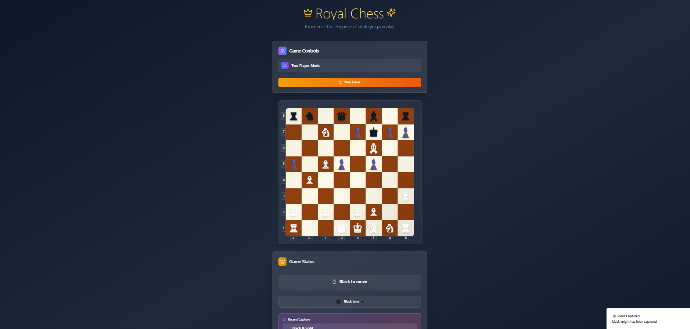
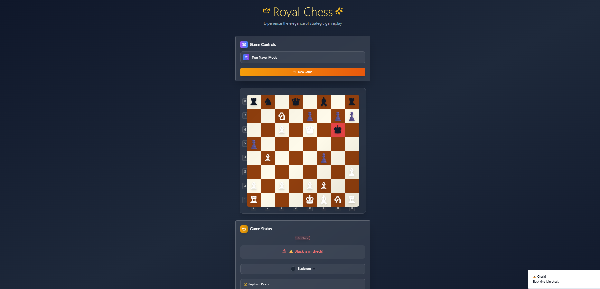

# Elegant Chess Masterpiece




A clean and elegant two-player chess web app built with React, Vite, and Tailwind CSS. Inspired by timeless design principles and crafted for smooth user interaction, this project brings the joy of classic chess to a modern browser interface.

## Table of Contents

* [Tech Stacks](#tech-stacks)
* [Features](#features)
* [Demo](#demo)
* [Installation](#installation)
* [Usage](#usage)
* [Contributing](#contributing)
* [License](#license)
* [Notes](#notes)

## 🔧 Tech Stacks

* **React:** Component-based JavaScript library for building user interfaces
* **TypeScript:** Strongly-typed superset of JavaScript
* **Vite:** Fast bundler and development environment
* **Tailwind CSS:** Utility-first CSS framework for effortless styling
* **ShadCN UI:** Accessible and elegant components built on Radix UI

## ✨ Features

* **Two-Player Mode:** Real-time chess game with turn-based logic
* **Interactive Chessboard:** Fully functional interface
* **Game State Tracking:** Displays turn, captures, and game end
* **Clean UI:** Minimalist layout for focused gameplay
* **Responsive Design:** Optimized for both desktop and mobile views

## 🚀 Demo

[View Live Demo](https://elegant-chess-masterpiece.vercel.app/)

## 🛠️ Installation

### 1. Clone the Repository

```bash
git clone https://github.com/joELL-lab/Final-Project-Front-End-Elegant-Chess-.git
cd elegant-chess-masterpiece
```

### 2. Install Dependencies

```bash
npm install
```

### 3. Run the Application

```bash
npm run dev
```

Then open [http://localhost:5173](http://localhost:5173) in your browser.

## 📚 Usage

This project can serve as a reference or base for building real-time strategy board games. It demonstrates clean UI construction, component reuse, and responsive layout with Tailwind and ShadCN.

You can customize the theme, logic, or even integrate multiplayer functionality with WebSockets or Firebase.

## 🤝 Contributing

Contributions are welcome! To contribute:

1. **Fork the Repository**
2. **Create a Feature Branch:**
   `git checkout -b feature/YourFeature`
3. **Commit Your Changes:**
   `git commit -m "Add feature description"`
4. **Push to the Branch:**
   `git push origin feature/YourFeature`
5. **Open a Pull Request**

## 📄 License

This project is licensed under the MIT License. See the [LICENSE](LICENSE) file for details.

## 📝 Notes

This project was built to learn and explore modern UI frameworks and game logic implementation using React and TypeScript. The design was crafted with simplicity and usability in mind.
